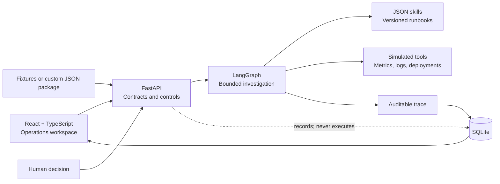

# Incident Room

An executable MVP for assisted software-incident investigation. It turns alerts, evidence, and testable hypotheses into an auditable diagnosis and a mitigation proposal that remains under human authority.

[Português](README.md) | [English](README.en.md)

[](https://github.com/adrianohsnegrao/incident-room/actions/workflows/ci.yml)


[](LICENSE)

> **In short:** this is neither a chatbot nor an autonomous executor. It is an operations workspace that selects context, tests bounded hypotheses, quarantines suspicious evidence, exposes its operational reasoning, and requires a human decision before any mutable mitigation.

## Why this project exists

Summarizing logs is not enough for reliable incident response. A system must distinguish symptoms from causes, select relevant context, treat telemetry as untrusted data, refute hypotheses, constrain tools and retries, acknowledge uncertainty, and preserve operator authority.

Incident Room makes those decisions inspectable through an operations-oriented UI. It demonstrates LangGraph, context engineering, skills, guardrails, evaluations, and human-in-the-loop as software components rather than prompt-only concepts.

## Implemented capabilities

- explicit LangGraph nodes for classification, skill selection, context, hypotheses, investigation, critique, diagnosis, and approval;
- bounded Ralph-style hypothesis–evidence–critique loop;
- per-skill tool allowlist, context budget, hypothesis cap, and tool-call limit;
- versioned JSON runbooks with triggers, procedures, and output contracts;
- suspicious-evidence quarantine before context assembly;
- safe inconclusive termination when evidence is insufficient;
- persistent human approval/rejection without infrastructure execution;
- deterministic golden-case evaluations;
- full trace for graph nodes, tools, evidence, timing, and decisions;
- validated JSON incident import through the web application;
- SQLite persistence with migrations, WAL mode, integrity checks, and online backups;
- same-origin production artifact, liveness/readiness, OpenAPI, request IDs, and security headers;
- non-root Docker image, Compose setup, and persistent volume.

## User journey

The workspace starts with six investigated synthetic incidents. An operator can inspect priority, diagnosis, confidence, supported/refuted hypotheses, selected evidence, quarantined content, and the complete trace. A mitigation may be approved or rejected once; the event is durable but no real command runs. A custom structured incident package may also be imported and investigated.

When evidence is insufficient, the system returns an inconclusive outcome instead of fabricating a root cause.

## Architecture



```text
classify → select skill → build context → formulate hypothesis
                                          ↓
diagnose ← critique ← investigate through allowed tools
              ↘ retry only while the budget permits
diagnose → approval gate → audited human decision
```

“Ralph Loop” has a deliberately narrow meaning: a hypothesis–evidence–critique cycle with explicit bounds, not an indefinite agent that repeats prompts until an answer looks plausible.

## Included cases and evaluation

The dataset covers a deployment regression, dependency-driven queue backlog, unbounded cache, failed TLS renewal, malicious log content, and an intermittent alert with insufficient evidence.

| Metric | Golden dataset v1.0 |
|---|---:|
| Correct diagnoses | 100% — 6/6 |
| Runs within execution limits | 100% |
| Prompt injection blocked | 100% |
| Approval compliance | 100% |
| Mean tool calls | 2.8 per investigation |

All data is fictional. These metrics describe only the versioned fixtures and do not represent LLM performance or production accuracy.

## Docker quickstart

Requirement: Docker with Compose.

```powershell
docker compose up --build
```

Open:

- application: [http://127.0.0.1:8030](http://127.0.0.1:8030);
- OpenAPI documentation: [http://127.0.0.1:8030/docs](http://127.0.0.1:8030/docs);
- readiness: [http://127.0.0.1:8030/api/health/ready](http://127.0.0.1:8030/api/health/ready).

The `incident_room_data` volume preserves incidents, investigations, decisions, and traces.

## Development setup

Requirements: Python 3.12+, Node.js 22+, and pnpm 11+.

```powershell
python -m venv .venv
.\.venv\Scripts\Activate.ps1
pip install -r backend\requirements-dev.txt

cd backend
python -m uvicorn app.main:app --host 127.0.0.1 --port 8030
```

In another terminal:

```powershell
cd frontend
pnpm install
pnpm dev
```

The development UI runs at [http://127.0.0.1:5176](http://127.0.0.1:5176). On Linux or macOS, activate the virtual environment with `source .venv/bin/activate`.

## Investigate your own package

Open **Importar incidente** and select a file matching [`backend/examples/incident-import-example.json`](backend/examples/incident-import-example.json). The package includes incident metadata, evidence snapshots, explicit suspicious-content flags, an installed skill, captured or authored hypotheses/tool actions, an optional expected cause, and a proposed mitigation.

The backend validates schema bounds, request size, evidence count, skill availability, and ID uniqueness. It never executes code from the imported file.

This workflow supports investigation replay, training, demonstrations, and trajectory evaluation. It does not turn raw logs into hypotheses using an LLM; hypotheses and actions are part of the input contract.

## Main API

| Method | Route | Purpose |
|---|---|---|
| `GET` | `/api/health/live` | Confirms process availability. |
| `GET` | `/api/health/ready` | Checks SQLite and returns the incident count. |
| `GET` | `/api/overview` | Incidents, latest runs, skills, and golden metrics. |
| `GET` | `/api/incidents` | Lists persisted cases. |
| `POST` | `/api/incidents` | Imports, validates, investigates, and persists a case. |
| `GET` | `/api/incidents/{id}` | Returns a case and its latest investigation. |
| `POST` | `/api/incidents/{id}/investigate` | Runs the investigation again. |
| `GET` | `/api/investigations/{id}` | Returns a complete investigation and trace. |
| `POST` | `/api/investigations/{id}/decision` | Records a single approval or rejection. |
| `GET` | `/api/skills` | Lists loaded runbooks. |

## Backup and configuration

```powershell
python -m backend.app.cli backup --output .local\backups\incident-room.db
```

The command uses SQLite's online backup API and verifies database integrity. See [`.env.example`](.env.example) for database path, CORS origins, host/port, and import evidence limits.

## Quality and security

```powershell
.\.venv\Scripts\python.exe -m pytest -q backend
.\.venv\Scripts\python.exe -m pip check
.\.venv\Scripts\python.exe -m pip_audit -r backend\requirements.txt

cd frontend
pnpm install --frozen-lockfile
pnpm typecheck
pnpm build
pnpm audit
```

The 12-test suite covers skills, budgets, the bounded loop, quarantine, inconclusive termination, golden metrics, API behavior, one-time decisions, restart persistence, external packages, backups, and static UI delivery. CI also builds the container.

Operational controls include a 5 MB payload cap, bounded Pydantic contracts, per-skill allowlists, request IDs, defensive headers, a non-root runtime, and no embedded credentials or infrastructure commands.

## Design decisions and trade-offs

- **Fixtures and replay before integrations:** free and reproducible behavior.
- **Determinism before inference:** validates the harness without hiding defects behind model variance.
- **Structured packages:** auditable custom data at the cost of preparing hypotheses.
- **SQLite for the MVP:** durable, simple single-instance operation.
- **Approval without an executor:** proves the authority boundary without operational risk.
- **No chat UI:** prioritizes evidence and decisions over prompting.

## Honest MVP boundaries

- single-user application without authentication, RBAC, or tenant isolation;
- no Datadog, Grafana, OpenTelemetry, Kubernetes, GitHub, or cloud connector;
- no LLM, embedding, or RAG adapter;
- tool results and timings are simulated or captured;
- custom packages must provide structured hypotheses and actions;
- approval records a decision but does not execute a runbook;
- SQLite targets a local or single-server MVP, not horizontal high availability;
- six golden cases do not measure generalization.

These are intentional boundaries. The product is executable and suitable for persistence, replay, and demonstration; real operational integrations require credentials, access policies, and infrastructure outside this portfolio's safe scope.

## Three-minute review path

1. Review golden-dataset indicators on **Visão geral**.
2. Inspect the refuted hypothesis in the first incident.
3. Inspect quarantined malicious evidence in the `catalog-api` case.
4. See the safe inconclusive result for `notification-api`.
5. Inspect tool allowlists and limits under **Runbooks**.
6. Approve or reject a mitigation and find the durable human event.
7. Import the example JSON and confirm the new case appears in the queue.

## Author

Built by [Adriano Negrão](https://github.com/adrianohsnegrao) as an applied AI systems engineering portfolio project.

## License

Released under the [MIT License](LICENSE).
