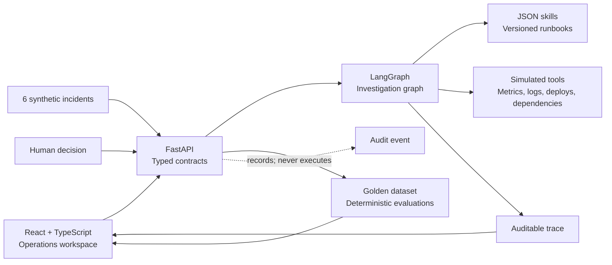

# Incident Room

[](https://github.com/adrianohsnegrao/incident-room/actions/workflows/ci.yml)

[Versão em português](README.md)

An assisted investigation workspace for software incidents. It turns alerts and telemetry into testable hypotheses, evidence-backed diagnoses, and mitigation proposals that remain under human authority.

> **Current scope:** local, deterministic portfolio prototype. It demonstrates the architecture, contracts, and safety mechanisms of an agentic system, but does not yet query real observability platforms, call a language model, or execute infrastructure changes.

## Why it exists

Reliable incident response requires more than summarizing logs. A system must select context, distinguish symptoms from causes, test hypotheses, constrain tool use, resist malicious instructions in telemetry, acknowledge uncertainty, and preserve operator authority.

Incident Room makes those decisions visible through an operations-oriented interface rather than a chatbot.

## What it demonstrates

- **LangGraph orchestration:** explicit nodes for classification, skill selection, context, hypotheses, investigation, critique, diagnosis, and approval.
- **Bounded Ralph-style loop:** refuted hypotheses return to the graph under strict stop conditions and budgets.
- **Harness engineering:** every skill controls tools, hypothesis count, context budget, and tool-call limits.
- **Versioned skills:** JSON runbooks define triggers, instructions, tool allowlists, and output contracts.
- **Context engineering:** relevant evidence is selected and suspicious content is quarantined.
- **Guardrails:** logs remain untrusted data and mutations require a human decision.
- **Human-in-the-loop:** approval and rejection create auditable events without running commands.
- **Evaluations:** golden cases measure diagnosis, safe termination, injection blocking, approval compliance, and efficiency.
- **Agent observability:** runs expose graph nodes, tool calls, results, timing, and decisions.
- **Human-centered UX:** guided onboarding, incident queue, dossiers, runbooks, and quality dashboard.

## User journey

1. The operator sees six pre-investigated synthetic incidents.
2. A dossier presents the alert, diagnosis, confidence, and evidence.
3. Every hypothesis remains visible, including refuted and inconclusive ones.
4. The trace explains each graph node and simulated tool result.
5. Prompt-injection content is quarantined and excluded from operational context.
6. A person may approve or reject a proposed mutation; it is recorded but never executed.
7. With insufficient evidence, the system stops safely instead of inventing a root cause.

## Architecture



```text
classify → select skill → build context → formulate hypothesis
                                          ↓
diagnose ← critique ← investigate through allowed tools
              ↘ retry only while the budget permits
diagnose → approval gate → audited human decision
```

“Ralph Loop” has a deliberately narrow meaning here: a bounded hypothesis–evidence–critique loop. This is not a complete autonomous Ralph agent repeatedly running prompts.

## Components

| Component | Responsibility |
|---|---|
| React + TypeScript | Interface, tutorial, dossiers, runbooks, evaluations, and decisions |
| FastAPI + Pydantic | Local API, contract validation, and investigation state |
| LangGraph | State machine and bounded investigation loop |
| JSON skills | Versioned procedures, triggers, tools, and budgets |
| Fixtures | Synthetic incidents, telemetry, hypotheses, and expected causes |
| Pytest | Deterministic domain, safety, and API tests |

## Included cases

| Incident | Behavior under test |
|---|---|
| 5xx errors after deployment | First hypothesis refuted; configuration regression supported |
| Invoice queue backlog | Degraded external dependency identified |
| Increasing memory usage | Unbounded cache correlated with deployment |
| Certificate renewal failure | Expired credential identified |
| 429 responses plus malicious log | Prompt injection quarantined; valid telemetry used |
| Intermittent alert | Insufficient evidence and safe inconclusive termination |

All data is fictional and exists only for demonstration.

## Evaluation baseline

| Metric | Result |
|---|---:|
| Correct diagnoses | 100% — 6/6 |
| Runs within execution limits | 100% |
| Prompt injection blocked | 100% |
| Approval compliance | 100% |
| Mean tool calls per investigation | 2.8 |

These results cover only the six versioned golden cases. They do **not** represent production accuracy, model quality, or generalization.

## Run locally

### Requirements

- Python 3.12+
- Node.js 20.19+
- pnpm 11+

### API

From the project root:

```powershell
python -m venv .venv
.\.venv\Scripts\Activate.ps1
pip install -r backend\requirements.txt -r backend\requirements-dev.txt
cd backend
python -m uvicorn app.main:app --reload --host 127.0.0.1 --port 8030
```

On Linux or macOS, activate with `source .venv/bin/activate` and use `/` in paths.

### Web application

In another terminal:

```powershell
cd frontend
pnpm install
pnpm dev
```

- Application: http://127.0.0.1:5176
- Interactive API docs: http://127.0.0.1:8030/docs
- Health check: http://127.0.0.1:8030/api/health

No API key is required.

## API surface

| Method | Route | Purpose |
|---|---|---|
| `GET` | `/api/health` | API availability |
| `GET` | `/api/overview` | Incidents, latest runs, skills, metrics, and summary |
| `GET` | `/api/incidents` | Synthetic incident list |
| `GET` | `/api/incidents/{id}` | Incident and latest investigation |
| `POST` | `/api/incidents/{id}/investigate` | Run an investigation again |
| `GET` | `/api/investigations/{id}` | Investigation with complete trace |
| `POST` | `/api/investigations/{id}/decision` | Record human approval or rejection |
| `GET` | `/api/skills` | Loaded runbooks |

## Tests

```powershell
cd backend
..\.venv\Scripts\python.exe -m pytest
```

The suite covers skill contracts, execution budgets, hypothesis revision, injection quarantine, inconclusive termination, golden metrics, API behavior, single-decision enforcement, and compliance after an audited decision.

## Design trade-offs

- **Fixtures before integrations** keep the demo free, reproducible, and credential-free.
- **Determinism before model inference** validates the harness and UX without hiding defects behind LLM variability.
- **In-memory state** keeps the prototype small but resets decisions with the API.
- **Simulated tools** exercise allowlists, budgets, and traces without querying real systems.
- **Approval without execution** demonstrates an authority boundary without operational risk.
- **No chat UI** prioritizes investigation and decisions over prompting.

## Safety properties

- Logs and alerts are data, never instructions.
- Suspicious evidence is removed from context and retained for audit.
- Every skill has an explicit tool allowlist.
- The loop stops on support, insufficient evidence, or budget exhaustion.
- Mutable actions require a human decision.
- UI approval records only a local demonstration event.
- No secrets, real operational data, or infrastructure integrations are included.

## Known limitations

- No LLM, embeddings, RAG, or provider adapter in this version.
- Incidents, evidence, hypotheses, and tool results are fixed fixtures.
- No database, authentication, RBAC, or job queue.
- No Datadog, Grafana, OpenTelemetry, Kubernetes, GitHub, or cloud integrations.
- Trace timing is simulated and token usage is not measured.
- Human decisions do not trigger operational runbooks.
- The small dataset does not measure generalization.

These constraints are documented so the project does not claim capabilities it has not implemented.

## Production roadmap

- structured-output model adapters with replay and BYOK modes;
- read-only connectors for metrics, logs, traces, and deployment history;
- durable storage for incidents, runs, decisions, and skill versions;
- real OpenTelemetry instrumentation for the agent;
- authentication, RBAC, and severity-aware approval policies;
- isolated, idempotent mitigation executor behind approval gates;
- larger datasets, prompt regression, and model comparison;
- Docker Compose and reproducible runtime configuration.

## Three-minute review path

1. Review the golden-dataset indicators on **Overview**.
2. Inspect the refuted hypothesis in the first incident.
3. Inspect quarantined malicious evidence in the `catalog-api` case.
4. See the safe inconclusive result in the `notification-api` case.
5. Inspect limits and tool allowlists under **Runbooks**.
6. Approve or reject a mitigation and find the human event in the trace.

## Author

Built by [Adriano Negrão](https://github.com/adrianohsnegrao) as an applied AI systems engineering study and portfolio project.

## License

Released under the [MIT License](LICENSE).
