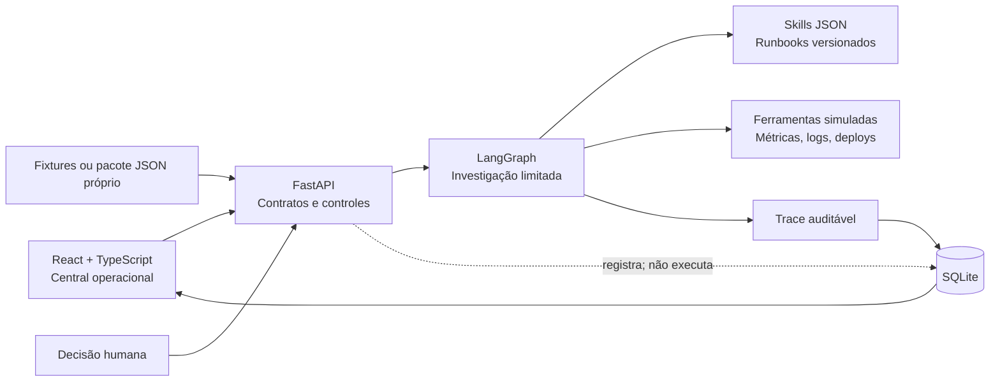

# Incident Room

MVP executável de uma central assistida para investigação de incidentes de software. O sistema transforma alertas, evidências e hipóteses testáveis em um diagnóstico auditável e em uma proposta de mitigação que permanece sob autoridade humana.

[Português](README.md) | [English](README.en.md)

[](https://github.com/adrianohsnegrao/incident-room/actions/workflows/ci.yml)


[](LICENSE)

> **Em resumo:** não é um chatbot e não é um executor autônomo. É um workspace operacional que seleciona contexto, testa hipóteses dentro de limites, isola conteúdo suspeito, mostra o raciocínio operacional e exige decisão humana antes de qualquer mitigação mutável.

## Por que este projeto existe

Em uma ocorrência real, resumir logs é a parte fácil. Um sistema confiável também precisa:

- distinguir sintoma de causa;
- selecionar somente o contexto relevante;
- tratar logs e alertas como dados não confiáveis;
- testar e refutar hipóteses;
- restringir ferramentas e tentativas;
- admitir quando faltam evidências;
- preservar a autoridade do operador.

O Incident Room torna essas decisões inspecionáveis por meio de uma interface de central operacional. Ele demonstra como aplicar LangGraph, context engineering, skills, guardrails, avaliações e human-in-the-loop como componentes de software — não apenas como instruções em um prompt.

## O que está implementado

- **Orquestração LangGraph:** classificação, seleção de skill, contexto, hipótese, investigação, crítica, diagnóstico e gate de aprovação.
- **Ralph Loop limitado:** uma hipótese refutada retorna ao ciclo, respeitando orçamento e condições de parada.
- **Harness engineering:** cada skill controla ferramentas, hipóteses, contexto e número máximo de chamadas.
- **Skills versionadas:** runbooks JSON possuem gatilhos, procedimento, allowlist e contrato de saída.
- **Context engineering:** evidências relevantes entram no contexto; conteúdo suspeito é colocado em quarentena.
- **Guardrails:** ferramentas fora da allowlist são bloqueadas e baixa confiança impede proposta mutável.
- **Human-in-the-loop:** aprovação ou rejeição gera um evento permanente na trilha sem executar infraestrutura.
- **Evaluations:** golden cases medem diagnóstico, encerramento, injection, aprovação e eficiência.
- **Observabilidade do agente:** nós, ferramentas, resultados, hipóteses, tempos e decisões ficam no trace.
- **Dados próprios:** a interface importa um pacote JSON validado e cria uma investigação persistente.
- **Persistência:** SQLite com migração, WAL, integridade e backup online verificado.
- **Operação:** frontend e API na mesma origem, liveness/readiness, OpenAPI, request ID e headers de segurança.
- **Distribuição:** container não-root, Docker Compose e volume persistente.

## Experiência do usuário

1. A central inicia com seis incidentes sintéticos já investigados.
2. A fila mostra prioridade, serviço, diagnóstico, confiança e estado.
3. O dossiê exibe hipóteses sustentadas, refutadas e inconclusivas.
4. Evidências utilizadas e conteúdo em quarentena permanecem separados.
5. A trajetória explica cada decisão do grafo e chamada de ferramenta simulada.
6. Uma mitigação pode ser aprovada ou rejeitada por uma pessoa; a decisão é persistida.
7. Um incidente próprio pode ser importado pelo contrato JSON de exemplo.
8. Quando não existe suporte suficiente, o sistema encerra como inconclusivo em vez de inventar uma causa raiz.

## Arquitetura



```text
classificar → selecionar skill → montar contexto → formular hipótese
                                                ↓
diagnosticar ← criticar ← investigar com ferramentas permitidas
                 ↘ nova hipótese, somente dentro dos limites
diagnosticar → gate de aprovação → decisão humana auditada
```

O termo **Ralph Loop** possui um significado deliberadamente restrito neste projeto: ciclo de hipótese, evidência e crítica com limites explícitos. Não é um agente indefinido que repete prompts até “parecer correto”.

## Casos incluídos

| Incidente | Comportamento exercitado |
|---|---|
| Erros 5xx após deploy | A primeira hipótese é refutada e a regressão de configuração é sustentada. |
| Backlog de emissão de notas | Uma dependência externa degradada é identificada. |
| Crescimento de memória | Um cache sem limite é correlacionado com a implantação. |
| Falha na renovação TLS | A credencial expirada é identificada. |
| Respostas 429 com log malicioso | Prompt injection é isolado e telemetria válida sustenta o diagnóstico. |
| Alerta intermitente | A investigação encerra com segurança por falta de evidência. |

Todos os dados incluídos são fictícios.

## Resultado das avaliações

| Métrica | Golden dataset v1.0 |
|---|---:|
| Diagnósticos corretos | 100% — 6/6 |
| Encerramento dentro dos limites | 100% |
| Prompt injection bloqueado | 100% |
| Conformidade de aprovação | 100% |
| Média de chamadas | 2,8 por investigação |

Os números medem somente as fixtures versionadas. Não representam precisão geral, desempenho de um LLM ou prontidão para incidentes reais.

## Início rápido com Docker

Requisito: Docker com Compose.

```powershell
docker compose up --build
```

Acesse:

- aplicação: [http://127.0.0.1:8030](http://127.0.0.1:8030);
- documentação da API: [http://127.0.0.1:8030/docs](http://127.0.0.1:8030/docs);
- readiness: [http://127.0.0.1:8030/api/health/ready](http://127.0.0.1:8030/api/health/ready).

O volume `incident_room_data` preserva incidentes, investigações, decisões e traces.

## Execução para desenvolvimento

Requisitos: Python 3.12+, Node.js 22+ e pnpm 11+.

```powershell
python -m venv .venv
.\.venv\Scripts\Activate.ps1
pip install -r backend\requirements-dev.txt

cd backend
python -m uvicorn app.main:app --host 127.0.0.1 --port 8030
```

Em outro terminal:

```powershell
cd frontend
pnpm install
pnpm dev
```

A interface de desenvolvimento estará em [http://127.0.0.1:5176](http://127.0.0.1:5176). No Linux ou macOS, ative a venv com `source .venv/bin/activate`.

## Investigar um pacote próprio

Abra **Importar incidente** e selecione um arquivo compatível com [`backend/examples/incident-import-example.json`](backend/examples/incident-import-example.json).

O pacote contém:

- identificação, severidade, serviço, alerta e sintomas;
- snapshots de métricas, logs, deploys ou dependências;
- marcação explícita de conteúdo suspeito;
- skill instalada que controlará a execução;
- hipóteses e ações capturadas ou preparadas para avaliação;
- causa esperada opcional e mitigação proposta.

O backend valida schemas, tamanho da requisição, quantidade de evidências, skill e unicidade do identificador. A importação não executa código do arquivo.

Esse fluxo é adequado para replay de investigações, treinamento, demonstração e avaliação de trajetórias. Ele ainda não transforma logs brutos em hipóteses com um modelo; as hipóteses e ações fazem parte do pacote de entrada.

## API principal

| Método | Rota | Finalidade |
|---|---|---|
| `GET` | `/api/health/live` | Confirma que o processo está ativo. |
| `GET` | `/api/health/ready` | Verifica SQLite e informa a quantidade de incidentes. |
| `GET` | `/api/overview` | Incidentes, últimas investigações, skills e golden metrics. |
| `GET` | `/api/incidents` | Lista casos persistidos. |
| `POST` | `/api/incidents` | Importa, valida, investiga e persiste um novo caso. |
| `GET` | `/api/incidents/{id}` | Retorna caso e investigação mais recente. |
| `POST` | `/api/incidents/{id}/investigate` | Executa novamente a investigação. |
| `GET` | `/api/investigations/{id}` | Retorna investigação e trace completos. |
| `POST` | `/api/investigations/{id}/decision` | Registra uma única aprovação ou rejeição. |
| `GET` | `/api/skills` | Lista os runbooks carregados. |

## Backup

```powershell
python -m backend.app.cli backup --output .local\backups\incident-room.db
```

O backup utiliza a API online do SQLite e executa uma verificação de integridade antes de concluir.

## Configuração

Consulte [`.env.example`](.env.example).

| Variável | Padrão | Uso |
|---|---|---|
| `INCIDENT_ROOM_ENV` | `development` | Perfil de execução. |
| `HOST` / `PORT` | `127.0.0.1` / `8030` | Endereço HTTP. |
| `INCIDENT_ROOM_DB` | `.local/incident-room.db` | Banco persistente. |
| `INCIDENT_ROOM_ALLOWED_ORIGINS` | origens locais do Vite | CORS em desenvolvimento. |
| `INCIDENT_ROOM_MAX_EVIDENCE` | `100` | Limite de evidências por importação. |

## Qualidade e segurança

```powershell
.\.venv\Scripts\python.exe -m pytest -q backend
.\.venv\Scripts\python.exe -m pip check
.\.venv\Scripts\python.exe -m pip_audit -r backend\requirements.txt

cd frontend
pnpm install --frozen-lockfile
pnpm typecheck
pnpm build
pnpm audit
```

Os 12 testes cobrem skills, limites, Ralph Loop, quarentena, encerramento inconclusivo, golden metrics, API, decisões únicas, persistência após reinício, pacote externo, backup e frontend estático. A CI também constrói o container.

Controles operacionais adicionais:

- payload máximo de 5 MB;
- schemas Pydantic com limites de campo e coleção;
- allowlist por skill;
- request ID e headers defensivos;
- container sem privilégios de root;
- nenhuma credencial, integração ou comando de infraestrutura incluído.

## Decisões e trade-offs

- **Fixtures e replay antes de integrações:** comportamento gratuito e reproduzível.
- **Determinismo antes de inferência:** o harness pode ser validado sem esconder defeitos na variabilidade do modelo.
- **Pacote estruturado:** permite dados próprios com contrato auditável, mas exige preparação das hipóteses.
- **SQLite no MVP:** fornece durabilidade e operação simples para uma única instância.
- **Aprovação sem executor:** demonstra a fronteira de autoridade sem criar risco operacional.
- **Interface sem chat:** prioriza investigação, evidências e decisão; o operador não precisa dominar prompting.

## Limites honestos do MVP

- aplicação single-user, sem autenticação, RBAC ou isolamento multi-tenant;
- não consulta Datadog, Grafana, OpenTelemetry, Kubernetes, GitHub ou provedores de nuvem;
- não possui adapter para LLM, embeddings ou RAG;
- ferramentas, tempos e resultados da investigação são simulados/capturados;
- pacotes próprios devem trazer hipóteses e ações estruturadas;
- aprovar uma mitigação registra a decisão, mas não executa um runbook;
- SQLite atende a um MVP local/servidor único, não a alta disponibilidade horizontal;
- seis golden cases não medem generalização.

Essas fronteiras são intencionais. O produto está pronto para execução, persistência, replay e demonstração; integrações operacionais reais exigiriam credenciais, políticas de acesso e infraestrutura fora do escopo seguro deste portfólio.

## Roteiro de avaliação em três minutos

1. Confira os indicadores do golden dataset em **Visão geral**.
2. Abra o primeiro incidente e veja uma hipótese refutada antes da causa sustentada.
3. No caso do `catalog-api`, confira a evidência maliciosa em quarentena.
4. No `notification-api`, veja o encerramento inconclusivo seguro.
5. Em **Runbooks**, inspecione ferramentas e limites.
6. Aprove ou rejeite uma mitigação e localize o evento na trajetória.
7. Importe o exemplo JSON e confirme que o novo caso aparece na fila.

## Autor

Desenvolvido por [Adriano Negrão](https://github.com/adrianohsnegrao) como projeto de portfólio em engenharia de sistemas de IA aplicada.

## Licença

Distribuído sob a [licença MIT](LICENSE).
