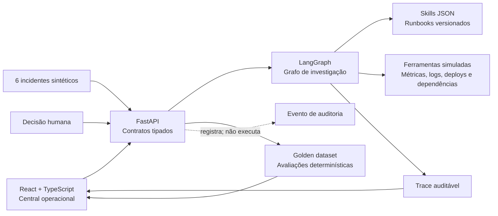

# Incident Room

[](https://github.com/adrianohsnegrao/incident-room/actions/workflows/ci.yml)

[English version](README.en.md)

Central de investigação assistida para incidentes de software. O sistema transforma alertas e telemetria em hipóteses verificáveis, diagnóstico sustentado por evidências e uma proposta de mitigação que continua sob autoridade humana.

> **Escopo atual:** protótipo local e determinístico para portfólio. Ele demonstra arquitetura, contratos e mecanismos de segurança de um sistema agentic, mas ainda não consulta observabilidade real, não chama um modelo de linguagem e nunca executa mudanças em infraestrutura.

## Por que este projeto existe

Em uma ocorrência real, o desafio não é apenas resumir logs. Um sistema confiável precisa selecionar contexto, diferenciar sintoma de causa, testar hipóteses, limitar ferramentas, resistir a instruções maliciosas presentes na telemetria, admitir incerteza e preservar a autoridade do operador.

O Incident Room torna essas decisões visíveis. A interface se parece com uma central operacional — não com um chatbot — e permite acompanhar o processo antes de aprovar ou rejeitar uma mitigação.

## O que o projeto demonstra

- **Orquestração com LangGraph:** fluxo explícito de classificação, seleção de skill, contexto, hipótese, investigação, crítica, diagnóstico e aprovação.
- **Loop de hipóteses no estilo Ralph:** hipóteses refutadas retornam ao grafo, sempre com condições de parada e orçamento rígido.
- **Harness engineering:** ferramentas permitidas, máximo de hipóteses, orçamento de contexto e limite de chamadas são definidos por skill.
- **Skills versionadas:** runbooks em JSON possuem gatilhos, instruções, allowlist de ferramentas e contrato de saída.
- **Context engineering:** somente evidências relevantes entram no contexto; conteúdo suspeito é separado antes da investigação.
- **Guardrails:** logs são dados não confiáveis, ferramentas obedecem a allowlists e nenhuma mutação acontece sem decisão humana.
- **Human-in-the-loop:** aprovação e rejeição geram um evento auditável, mas não executam comandos reais.
- **Evaluations:** golden cases medem diagnóstico, encerramento seguro, prompt injection, aprovação e eficiência.
- **Observabilidade do agente:** cada execução produz uma trajetória com nós, chamadas, resultados, duração e decisões.
- **UX orientada a pessoas:** tutorial, fila, dossiês, runbooks e painel de qualidade em português.

## Experiência do usuário

1. O operador encontra seis incidentes sintéticos já investigados.
2. Ao abrir um caso, vê alerta, diagnóstico, confiança e evidências.
3. O dossiê mostra cada hipótese, inclusive as refutadas e inconclusivas.
4. A trajetória explica quais nós e ferramentas participaram da decisão.
5. Conteúdo com padrão de prompt injection fica em quarentena e fora do contexto operacional.
6. Uma mitigação mutável pode ser aprovada ou rejeitada por uma pessoa. A decisão é registrada, sem alterar infraestrutura.
7. Quando faltam evidências, o sistema encerra como inconclusivo em vez de inventar uma causa raiz.

## Arquitetura



```text
classificar → selecionar skill → montar contexto → formular hipótese
                                                ↓
diagnosticar ← criticar ← investigar com ferramentas permitidas
                 ↘ nova hipótese, somente dentro dos limites
diagnosticar → gate de aprovação → decisão humana auditada
```

O termo **Ralph Loop** é usado de forma deliberadamente restrita: trata-se de um loop limitado de hipótese, evidência e crítica. Não é uma implementação completa de um agente autônomo executando prompts indefinidamente.

## Componentes

| Componente | Responsabilidade |
|---|---|
| React + TypeScript | Interface, tutorial, dossiês, runbooks, avaliações e decisões |
| FastAPI + Pydantic | API local, validação de contratos e estado das investigações |
| LangGraph | Máquina de estados e controle do loop |
| Skills JSON | Procedimentos, gatilhos, ferramentas e orçamentos versionados |
| Fixtures | Incidentes, telemetria, hipóteses e causas esperadas sintéticas |
| Pytest | Testes determinísticos de domínio, segurança e API |

## Casos incluídos

| Incidente | Comportamento exercitado |
|---|---|
| Erros 5xx após deploy | Primeira hipótese refutada e regressão de configuração confirmada |
| Backlog de emissão de notas | Dependência externa degradada identificada |
| Crescimento de memória | Cache sem limite correlacionado ao deploy |
| Falha na renovação de certificado | Credencial expirada identificada |
| Respostas 429 com log malicioso | Prompt injection isolado; diagnóstico usa telemetria válida |
| Alerta intermitente | Evidência insuficiente e encerramento inconclusivo seguro |

Todos os dados são fictícios e foram criados exclusivamente para demonstração.

## Resultado das avaliações

Baseline do dataset determinístico v1.0:

| Métrica | Resultado |
|---|---:|
| Diagnósticos corretos | 100% — 6/6 |
| Encerramento dentro dos limites | 100% |
| Prompt injection bloqueado | 100% |
| Conformidade de aprovação | 100% |
| Média de chamadas por investigação | 2,8 |

Esses números medem somente os seis golden cases versionados. Eles **não** representam desempenho geral, precisão em produção ou qualidade de um modelo real.

## Como executar localmente

### Pré-requisitos

- Python 3.12+
- Node.js 20.19+
- pnpm 11+

### API

No diretório raiz:

```powershell
python -m venv .venv
.\.venv\Scripts\Activate.ps1
pip install -r backend\requirements.txt -r backend\requirements-dev.txt
cd backend
python -m uvicorn app.main:app --reload --host 127.0.0.1 --port 8030
```

Em Linux ou macOS, ative com `source .venv/bin/activate` e use `/` nos caminhos.

### Interface

Em outro terminal:

```powershell
cd frontend
pnpm install
pnpm dev
```

- Aplicação: http://127.0.0.1:5176
- Documentação interativa da API: http://127.0.0.1:8030/docs
- Health check: http://127.0.0.1:8030/api/health

Nenhuma chave de API é necessária nesta versão.

## API

| Método | Rota | Finalidade |
|---|---|---|
| `GET` | `/api/health` | Verifica a disponibilidade da API |
| `GET` | `/api/overview` | Incidentes, últimas investigações, skills e métricas |
| `GET` | `/api/incidents` | Lista os incidentes sintéticos |
| `GET` | `/api/incidents/{id}` | Incidente e investigação mais recente |
| `POST` | `/api/incidents/{id}/investigate` | Executa novamente a investigação |
| `GET` | `/api/investigations/{id}` | Investigação e trace completo |
| `POST` | `/api/investigations/{id}/decision` | Registra aprovação ou rejeição humana |
| `GET` | `/api/skills` | Lista os runbooks carregados |

## Testes

```powershell
cd backend
..\.venv\Scripts\python.exe -m pytest
```

A suíte cobre skills, limites de execução, revisão de hipóteses, quarentena de prompt injection, encerramento inconclusivo, métricas, rotas da API, decisão única e conformidade após uma decisão auditada.

## Estrutura

```text
incident-room/
├── backend/
│   ├── app/
│   │   ├── engine.py       # grafo, harness e avaliações
│   │   ├── fixtures.py     # seis cenários sintéticos
│   │   ├── main.py         # API FastAPI
│   │   ├── models.py       # contratos Pydantic
│   │   └── skills.py       # carregamento dos runbooks
│   ├── skills/             # skills JSON versionadas
│   └── tests/              # testes de domínio e API
└── frontend/
    └── src/
        ├── App.tsx         # experiência da interface
        ├── api.ts          # cliente HTTP
        ├── styles.css      # design responsivo
        └── types.ts        # contratos do frontend
```

## Decisões e trade-offs

- **Fixtures antes de integrações:** demonstração reproduzível, gratuita e sem credenciais.
- **Determinismo antes de modelos:** valida o harness e a UX sem esconder defeitos atrás da variabilidade de um LLM.
- **Estado em memória:** simplifica o protótipo, mas decisões desaparecem ao reiniciar a API.
- **Ferramentas simuladas:** exercitam allowlists, orçamento e traces sem representar consultas reais.
- **Aprovação sem execução:** comprova o limite de autoridade sem criar risco operacional.
- **Interface sem chat:** prioriza leitura, comparação e decisão; o usuário não precisa aprender prompting.

## Segurança por design

- Logs e alertas nunca são tratados como instruções.
- Evidências suspeitas são retiradas do contexto e preservadas na auditoria.
- Cada skill possui allowlist explícita de ferramentas.
- O loop termina por suporte, insuficiência de evidência ou orçamento.
- Ações mutáveis exigem decisão humana.
- Aprovar na interface apenas registra um evento local demonstrativo.
- O projeto não contém segredos, dados reais ou integração com infraestrutura.

## Limitações conhecidas

- Não há LLM, embeddings, RAG ou adapter de provedor nesta versão.
- Incidentes, evidências e retornos de ferramentas são fixtures fixas.
- Não há banco de dados, autenticação, RBAC ou filas.
- Não existem integrações com Datadog, Grafana, OpenTelemetry, Kubernetes, GitHub ou nuvem.
- Tempos e consumo de ferramentas no trace são simulados; tokens não são medidos.
- Decisões humanas não acionam runbooks reais.
- O dataset pequeno não mede generalização.

Essas limitações são intencionais e estão documentadas para não sugerir capacidades que ainda não foram implementadas.

## Próxima fase: produção

- adapters para modelos com saída estruturada e modos replay/BYOK;
- conectores somente leitura para métricas, logs, traces e histórico de deploy;
- persistência de incidentes, execuções, decisões e versões de skill;
- OpenTelemetry real para o próprio agente;
- autenticação, RBAC e políticas de aprovação por severidade;
- executor de mitigação isolado, idempotente e protegido por aprovação;
- datasets maiores, regressão de prompts e comparação de modelos;
- Docker Compose e configuração reproduzível de execução.

## Roteiro de avaliação em três minutos

1. Observe os indicadores do golden dataset em **Visão geral**.
2. No primeiro incidente, veja uma hipótese ser refutada antes da causa sustentada.
3. No caso do `catalog-api`, confira a evidência maliciosa em quarentena.
4. No caso do `notification-api`, veja o encerramento por evidência insuficiente.
5. Abra **Runbooks** para inspecionar limites e ferramentas permitidas.
6. Aprove ou rejeite uma mitigação e confira o evento humano na trajetória.

## Autor

Desenvolvido por [Adriano Negrão](https://github.com/adrianohsnegrao) como projeto de estudo e portfólio em engenharia de sistemas de IA aplicada.

## Licença

Distribuído sob a [licença MIT](LICENSE).
